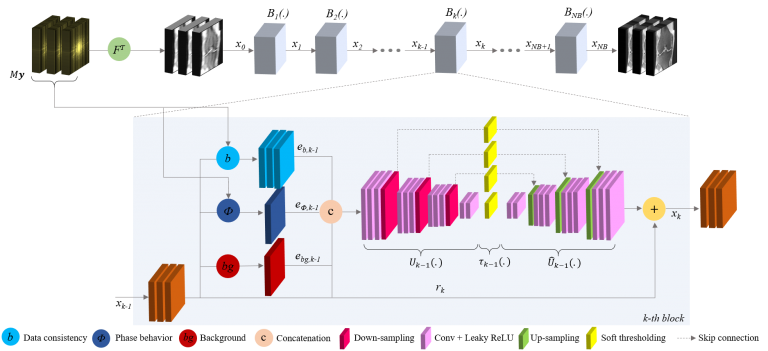

#  Biomedical Machine Learning
Section leader: prof. dr. ir. Marius Staring

This research line aims to develop generic machine learning approaches for automated image analysis, and to deploy these in clinical and life-science research as well as in clinical practice.

Important themes are the application of machine learning methods in radiation therapy, for image segmentation and registration, and in image acquisition and reconstruction. Together with the Department of Radiotherapy we explore the area of adaptive radiation therapy (photon as well as proton, CT as well as MRI), which is an interesting setting for its demand for real-time solutions that are robust to real-life variations in patients. We explore deep learning methods for segmentation of target areas and organs-at-risk, for regression problems such as image registration, and also link the two. Together with the Gorter Center and in collaboration with Philips we develop deep learning methods for accelerated MRI acquisition and reconstruction.

Fig. 1. A neural network architecture for MRI reconstruction.

Image registration is an important technique in the field of medical image processing. It refers to the process of spatially aligning datasets, possibly from different imaging modalities (e.g. MRI and CT), different time points (e.g., follow-up scans or dynamic studies), and even different subjects. In many applications, this involves the estimation of nonrigid deformations. Examples are the modeling of patterns of development or degeneration (e.g. local growth or atrophy), estimating soft tissue motion and deformation, and assessing or compensating for between-subject anatomical differences. Part of our research focuses on deep learning solutions towards robust, real-time application, for example in a radiation therapy setting.

Another important research focus is to ease the adoption of nonrigid image registration techniques in research and the clinic, by means of advanced interaction techniques, improved visualization, and high quality open access software implementation. The latter is realized through our image registration toolkit [elastix](https://elastix.dev).

## Current projects
- [Open source image registration: the elastix toolbox](bml/elastix.md)
- [Development of Machine Learning Techniques in Vestibular Schwannoma Treatment: Quantification, Characterization, and Risk Stratification](bml/schwannoma.md)
- [Human-centric AI for contouring in head-and-neck cancer](bml/humen_centric.md)
- [Robust diffusion-weighted MRI for non-invasive monitoring of proton beam treatment](bml/proton_beam.md)
- [Accelerated MRI acquisition and reconstruction](bml/accelerated.md)
- [Machine Learning on mixed data from the clinic and from wearable sensors](bml/wearable.md)
- New deep learning techniques for effective and robust radiotherapy planning

## Previous projects
- ADAPTNOW: High-Precision Cancer Treatment by Online Adaptive Proton Therapy
- Esophageal Gross Tumor Volume Segmentation using Deep Learning
- Registration visualization
- Medical Image Registration – Linking Algorithm and User
- Fast Image Registration for Time-critical Medical Applications
- Brain MRI Image Analysis for an Ageing Population

## Associated researchers
- Laurens Beljaards
- Yunjie Chen
- Niels Dekker
- Ruochen Gao
- Prerak Mody
- Chinmay Rao
- Marius Staring
- Viktor van der Valk