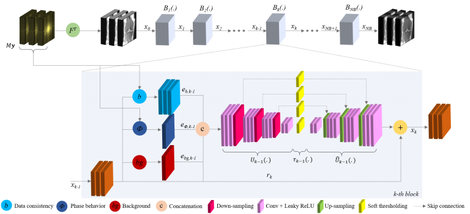

#  Accelerated MRI acquisition and reconstruction
Principal investigators from LUMC: dr. Marius Staring and prof. Thijs van Osch

Magnetic Resonance Imaging (MRI) is a widely applied non-invasive imaging modality, with excellent soft tissue contrast and high spatial resolution. Unlike Computed Tomography (CT) scanning, MRI does not expose patients to any ionizing radiation, making it a compelling alternative. MR images are essential for clinical assessment of soft tissue as well as functional and structural measurements, which leads to early detection and diagnosis of many diseases. However, MRI is relatively slow compared to other imaging modalities. The total examination time can vary from 15 minutes for knee imaging to an hour or more for cardiac imaging. Remaining still for this long in a confined space is challenging for any patient, being especially difficult for children, elderly and patients under pain. Therefore, fast acquisition and reconstruction are crucial to improve the performance of current MR scanners, which led in recent years to the development of techniques such as parallel reception, compressed sensing and multi-band accelerations. However, there is still a need for further scan acceleration.

Fig. 1: A deep learning architecture for accelerated MRI reconstruction.

## Associated researchers
- Laurens Beljaards
- Mohamed Elbially
- Faisal Hasan
- Thijs van Osch
- Nicola Pezzotti (Philips and TUe)
- Marius Staring
- Sahar Yousefi

## Publications
- November 2021, Philips integrates the Adaptive-CS-Net solution in Philips Smart Speed.
- N. Pezzotti, S. Yousefi, M.S. Elmahdy, et al., “An Adaptive Intelligence Algorithm for Undersampled Knee MRI Reconstruction,” IEEE Access, vol. 8, pp. 204825 – 204838, 2020.