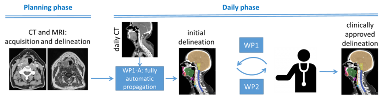

#  Human-centric AI for contouring in head-and-neck cancer
This project is funded by the HollandPTC – Varian consortium, grant number 2019022

September 2020 – September 2024

Principal investigator from LUMC: dr. Marius Staring

Proton therapy (PT) has unique potential to spare healthy tissues. However, the highly localized dose deposition makes PT sensitive to variations in the patient’s pose and anatomy that occur on time scales ranging from seconds (e.g. breathing) to weeks (e.g. weight loss). Current practice in radiation therapy (RT) is to generate a treatment plan based on a single snapshot of the patient’s anatomy and to use safety margins or robustness in the treatment plan to account for such changes. Unfortunately, both solutions result in additional dose to healthy tissues, substantially diminishing the benefit of PT.

Image-guided online-adaptive proton therapy (IGOAPT) is an evolving paradigm that seeks to account for anatomical changes throughout the course of treatment and enable more accurate targeting of the tumor. IGOAPT relies on several components working in concert, including image guidance, re-contouring and its quality assurance (QA), plan adaptation and dose calculation, and QA of the final dose distribution. This proposal targets the second step of IGOAPT: re-contouring with integrated QA.

The aim of this project is to develop human-centric deep learning methods to quickly and accurately locate and segment the tumor and organs-at-risk (OARs) based on planning as well as daily imaging. Specifically, we will focus on segmentation of the tumor and OARs in head-and-neck cancer. IGOAPT for head-and-neck cancer may aid in a reduction of side-effects such as xerostomia and dysphagia, which significantly impair patient’s quality-of-life. OAR segmentation in head-and-neck cancer is especially challenging due to the large amount of involved structures, such as optic structures, salivation-related structures, structures related to swallowing, the brachial plexus and intra-cranial structures, which leads to delineation variation between human observers.

We envision a workflow (see Fig. 1) where initially a fully automatic convolutional neural network would predict a first estimate of the segmentations. The result would be presented to a human operator in such a way that it will facilitate the QA and where human interaction is minimized. Human attention will be directed to areas where input is most needed and/or most beneficial. This can for example be areas where likely the most mistakes were made (based on prior clinical knowledge and/or model uncertainty), or where the predicted output is in the outer tails of the learned distribution. Upon inspection, the human will give very limited feedback, and avoid to actually draw a complete contour, which is too time-consuming. One may think of manipulation by fingers on a touch-screen, or the use of scribbles. Then, a second neural network will consider the first estimate together with the cues provided by the human, to produce an improved segmentation. By repeating this process a few times until the radiation oncologist is satisfied, a segmentation is obtained that can be approved for use in radiation planning. This workflow should be optimized so that transitions back and forth are minimized. The combined workflow is expected to drastically improve delineation and QA time.

Fig. 1: The envisioned workflow.

### Associated researchers
- Nicolas Chaves-de-Plaza
- René van Egmond
- Klaus Hildebrandt
- Prerak Mody
- Coen Rasch
- Marius Staring

### Publications
- P.P. Mody, N. Chaves-de-Plaza, K. Hildebrandt, R. van Egmond, A. Villanova and M. Staring, “Comparing Bayesian Models for Organ Contouring in Head and Neck Radiotherapy,” SPIE Medical Imaging: Image Processing, in press.
- N. Chaves-de-Plaza, P.P. Mody, K. Hildebrandt, H. de Ridder, M. Staring and R. van Egmond, “Towards Fast and Robust AI-Infused Human-Centered Contouring Workflows For Adaptive Proton Therapy in the Head and Neck,” European Chapter of the Human Factors and Ergonomics Society, in press.