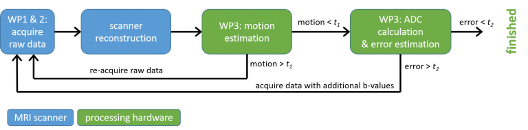

#  Robust diffusion-weighted MRI for non-invasive monitoring of proton beam treatment
This project is funded by NWO HTSM, grant number 17104 (April 2019 – April 2023)

Principal investigators from LUMC: dr. Marius Staring and prof. Thijs van Osch

The overall goal of this research is to improve the robustness and quantification of diffusion-weighted MRI for tumour differentiation and treatment follow-up. These improvements would have applications to many different types of cancer, but in this proposal, we have opted for a clinical focus on head/neck and eye tumour patients undergoing treatment at the Holland Proton Therapy Center (HPTC). These are some of the most challenging tumours on which to obtain high quality MRI-data due to motion and large magnetic susceptibility effects. Quantitative diffusion-weighted MRI (DWI) is an essential non-invasive tool in the diagnosis, tumour delineation and treatment monitoring of cancer throughout the body, and there is strong evidence that when acquired in a robust and reproducible fashion, changes in the apparent diffusion coefficient (ADC) can be a predictor of treatment response. However, DWI is also the clinical technique which is most susceptible to image artifacts. The percentage of scans that are non-useful is extremely high, and results across centres are highly variable. As response-adapted therapy becomes more widespread in cancer treatment, there will be a much greater need for performing intra-treatment scanning. This is especially true for proton therapy, which allows sharper transition zones between treated and non-treated tissue, thereby enabling less damage to healthy tissue, but also a higher risk of missing parts of the tumor during treatment.

In this part of the project we will implement real-time quality-control procedures with decisions on re-acquisition of small data packages. New developments in image reconstruction via machine learning will enable real-time control of the data acquisition process to obtain high quality data irrespective of, for example, motion or patient size/geometry.

### Associated researchers
- Kirsten Koolstra
- Thijs van Osch
- Marius Staring

### Publications
- K. Koolstra, M. Staring, P. de Bruin and M.J.P. van Osch, “Subject-specific optimization of background suppression for arterial spin labeling MRI using a real-time feedback loop on the scanner,” ISMRM, in press.
- K. Koolstra, M. Staring, P. de Bruin and M.J.P. van Osch, “Individually optimized ASL background suppression using a real-time feedback loop on the scanner,” ESMRMB, October 2021.