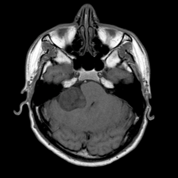
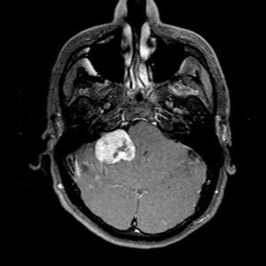
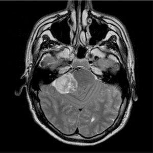

#  Development of Machine Learning Techniques in Vestibular Schwannoma Treatment: Quantification, Characterization, and Risk Stratification

This project is funded by the Chinese Scholarship Counsil, grant number
November 2020 – November 2024

Principal investigator from LUMC: dr. Qian Tao and dr. Marius Staring

Vestibular Schwannoma (VS), which originates from the nerve sheath of vestibular nerves, is the most common extra-axial tumor in the posterior fossa of adults. VS causes hearing loss, dizziness, and tinnitus; when it grows large, it may press against brainstem and become life-threatening. A long-term follow-up is normally practiced for patients with VS and such tumors are preferably left untreated if they are stable; however, if they continuously grow and pose risk for patients, VSs are to be treated by surgical resection or radiation therapy as early as possible. As such, a timely, appropriate treatment decision is essential for patients’ quality of life, efficacy of the intervention, and cost-effectiveness of the medical system.

a
b
c

*Fig 1. Vestibular Schwannoma in multi sequence MRI, where the tumor is indicated by the white arrow: (a) VS in T2-weighted imaging; (b) VS in T1-weighted imaging; and (c) VS in Contrast Enhanced T1-weighted imaging, which has the best contrast.*

Conventionally, diagnosis of VS is based on various clinical factors: vertigo, tinnitus, hearing loss, etc. Nowadays, diagnosis and management of VS are facilitated by advanced imaging tools, in particular magnetic resonance imaging (MRI), as illustrated in Fig. 1. Information on tumor size, location, and growth can be extracted from serial MRI scans. A treatment decision is typically made by comprehensive evaluation of all available clinical characteristics and imaging features. In literature, a few studies have been performed on risk stratification of VS. In a recent work, Grady et al. developed a binary classification model to predict if VS will grow based on radiomics from MRI. However, none of these work has fully exploited the rich information from multi-sequence MRI, or established a convincing model to integrate imaging features with clinical characteristics for risk stratification. Besides, routine image analysis involves substantial manual work from radiologists to measure VS size and estimate its longitudinal changes, which is tedious and subjective.

State-of-the art machine learning and deep learning models hold great promise for both image analysis and risk stratification tasks, by (1) automatically processing multi-sequence MRI, (2) extracting relevant imaging features, and (3) identifying trends and patterns in complex high-dimensional image and clinical data. There is a gap between the state-of-the-art technique and current practice in VS; further research is warranted in this direction to improve the clinical management and treatment of VS patients.

### Associated researchers
- Yunjie Chen
- Erik Hensen
- Olaf Neve
- Stephan Romeijn
- Marius Staring
- Qian Tao
- Berit Verbist

### Publications
- O. Neve, Q. Tao, S. Romeijn, et al., “Fully Automated 3D Vestibular Schwannoma Segmentation: A multicentre multi-vendor study,” European Society of Head and Neck Radiology (ESHNR), September 2021.
- Q. Tao, S. Romeijn, O. Neve, et al., “Deep-Learning-based Detection and Segmentation of Vestibular Schwannoma: A Multi-Center and Multi-Vendor MRI Study,” RSNA, November 2020.