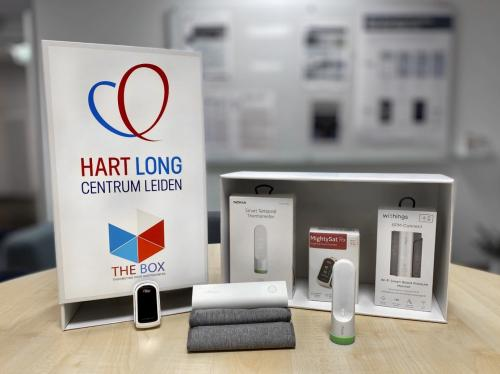

Machine Learning on mixed data from the clinic and from wearable sensors
This project is funded from the European Union’s Horizon 2020 research and innovation programme under the Marie Sklodowska-Curie grant agreement No 860173 – RISE-WELL.
mid 2021 – mid 2025

Principal investigators from LUMC: dr. Marius Staring and prof. dr. Boudewijn Lelieveldt

The use of smart, wearable devices that collect ambulatory medical data is becoming increasingly popular. In hospitals, part of the classical clinical assessments are being replaced by ambulatory assessments made by these devices. This type of (semi) automatic data collection opens the way for automated analysis and interpretation of data.

The analysis of this type of data, however, poses challenges for machine learning, since the data types and temporal scales vary substantially. Some medical devices measure continuously and can have temporal scales of seconds or minutes, while other devices only take daily or weekly measurements. Clinical data on the other hand is often only collected once upon diagnosis, or perhaps yearly during folllow-up. Moreover, the available data is highly heterogeneous, being text, step counts per day, high frequency ECG data, 2D/3D imaging scans, etc. While useful clinical patterns, risk factors or alarming signals may be present in the combination of this data, it is far from trivial to extract such information. The goal of this project is to develop new AI methodology to extract useful clinical information from highly heterogeneous clinical and wearable data.

The area of application is that of cardiovascular disease, specifically patients who suffered from a cardiac ischemia or a cardiac arrest. These patients benefit from close monitoring since relapse or complications often occur. Ambulatory medical devices could facilitate monitoring in this case, which is implemented in the LUMC through what is called ‘The Box’. The collected data contains information such as physical activity or sleep patterns, which possibly influence prognosis. This project focuses on the development of new AI methodology for prognosis prediction and influential factor analysis, in close collaboration with the original creators of The Box.

## Associated researchers
- Douwe Atsma
- Roderick Scherptong
- Marius Staring
- Esmee Stoop
- Viktor van der Valk