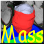
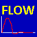
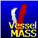

[Home](../index.md)

# Cardiac Image Analysis

Our research is dedicated to developing and evaluating innovative image analysis methods for the quantitative analysis of cardiovascular imaging data, including cardiac MRI, CT and Ultrasound. Key research areas encompass deep learning-based techniques for segmentation, image registration, abnormality detection and risk prediction. These methods are developed in close collaboration with clinical end-users both nationally and internationally. The primary goals are to optimize clinical workflows and to explore new quantitative imaging biomarkers for diagnosis, risk prediction, and treatment monitoring.

## Current and previous research
* Automated quantitative analysis of cardiac MRI
* Deep Learning-based segmentation of cardiac MRI
* Fully automated quantitative analysis of large cohort studies
* Automated interpretation of cardiac ultrasound exams using Deep Learning
* Prediction of sudden cardiac death in post-MI patients from LGE MRI
* Heart-Brain connection study
* Intra-cardiac flow analysis from 4D flow MRI
* Quantitative vascular analysis from contrast-enhanced MRA and TOF MRI data
* Vessel wall MR image analysis
* Whole body MR image analysis

## Software
Several of the image analysis software algorithms that were developed within our group have been transferred to industry for integration into commercially available clinical end products. Additionally, research software tools developed within the team are widely used in clinical research by numerous national and international centers. Software tools have been developed enabling rapid development of dedicated deep learning models for a specific type of imaging data. Imaging data from large cohort studies can be fully automatically processed using mode processing. The close interaction with research groups often results in opportunities for new research projects granted by national or international funding agencies.

|                                                               |                                                                                                                                                                                                                                           |
|---------------------------------------------------------------|-------------------------------------------------------------------------------------------------------------------------------------------------------------------------------------------------------------------------------------------|
|  MASS              | A comprehensive software package for the quantitative analysis of cardiovascular MR imaging studies, including analysis of LV function, strain, perfusion, late-enhancement, T1/T2 mapping and intra-cardiac flow analysis of 4D flow MRI |
|  FLOW              | A tool for quantitative flow analysis from standard 2D phase-contrast MRI                                                                                                                                                                 |
|  VesselMass | Software for the quantitative analysis of vessel wall morphology and plaque components                                                                                                                                                    |
|  LAVA        | Software for 3D segmentation and quantification of vascular structures from TOF and MRA image data                                                                                                                                        |

## People

|                                                |                   |                              |
|------------------------------------------------|-------------------|------------------------------|
|  | Rob van der Geest | Team lead                    |
|  | Patrick de Koning | Scientific Software Engineer |
|     | Li-Hsin Cheng     | PhD student                  |
