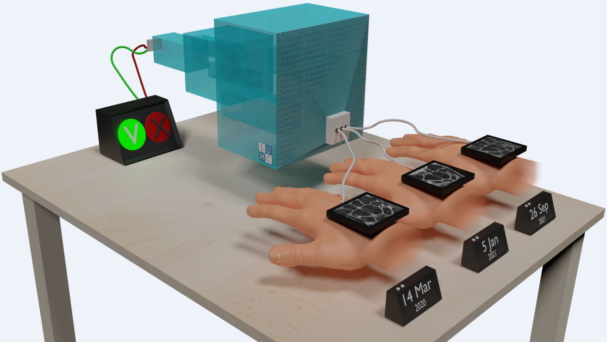

# AIMIRA

*AI*MIRA: Artificial-Intelligence-based Comparative MR Imaging in Detecting Inflammatory Changes in Rheumatoid Arthritis
This research is supported by the Netherlands Organisation for Scientific Research,Applied and Engineering Sciences (OTP), under grant number 17970

January 2021 – January 2025

Principal investigator: Berend C. Stoel

Rheumatoid arthritis (RA), characterized by inflammation of hand and foot joints, is prevalent and still a chronic disease in a majority of patients, requiring continuing treatment. Since early treatment in a pre-clinical phase may effectively prevent chronicity, drug evaluation trials have been set up. These trials require however far more sensitive and specific biomarkers, than trials on established RA. Magnetic Resonance Imaging (MRI) has become instrumental in detecting early inflammatory changes, but its sensitivity is hampered by the limitations of visual scoring. The goal of this project is therefore to develop artificial intelligence-based methods to automatically compare follow-up MRI scans with baseline scans, thereby providing highly sensitive and specific biomarkers and producing progression maps that can reveal locations where a treatment effect or natural progression predominantly occurred, using deep learning.

## Associated researchers:
- Tahereh Hassan-Zadeh, PhD
- Denis Shamonin, MSc
- Yanli Li, MSc
- Els Bakker, PhD