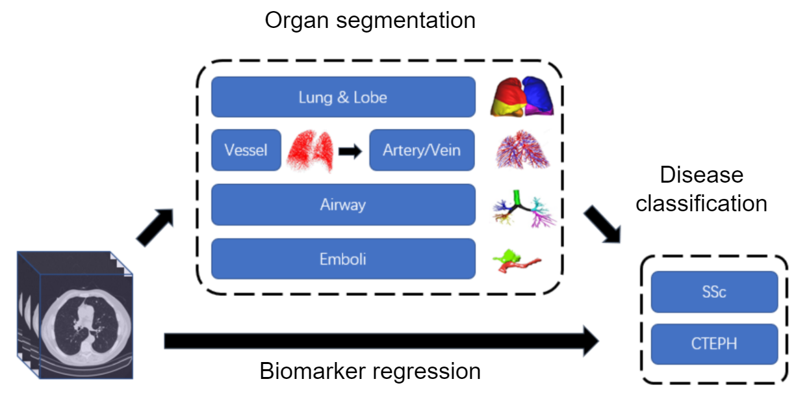

# Deep learning based Segmentation and biomarker regression on lung CT Images

This research is supported by the China Scholarship Council (CSC)

October 2019 – October 2023

Principal investigator: Berend C. Stoel

Computed Tomography (CT) plays an important role in the diagnosis of lung diseases. We aim to automatically obtain biomarkers from lung CT scans to diagnose lung diseases. The whole project overview is shown in the figure. It consists of two paths: a two-step path and a one-step path. Details are as follows.

Lung segmentation is normally regarded as the first step for lung disease detection. In addition, in order to quantify lung disease in specific regions of interest, lobe segmentation is also an important preprocessing step in the automated interpretation of lung CT, because some lung diseases predominantly affect certain lobes [1]. Furthermore, the segmentation of airways and lung vascular system can also provide some useful information for lung disease quantification. For instance, in Systemic Sclerosis (SSc) patients without detectable pulmonary fibrosis, impaired gas exchange is associated with alterations in pulmonary vascular morphology [2]. Therefore, we aim to perform the automatic segmentation of these anatomical structures, tissues and lesions.

After we obtained the segmentation results of airway, separated arteries and veins, or lesions, the correlation between some disease biomarkers and the segmented objects can be analyzed using traditional statistical regression methods or deep regression neural networks.

In addition to the two-step biomarker regression method mentioned above, a one-step method to automatically estimate lung disease is to use deep convolutional neural networks to predict biomarkers directly from lung CT scans. The hypothesis is that the raw CT scans include hidden features, which can be extracted by deep learning techniques. The hypothesis was verified by our recent work [3].

1. Jia, J., Zhai, Z., Bakker, M. E., Hernández-Girón, I., Staring, M., & Stoel, B. C. (2021, April). Multi-task Semi-supervised Learning for Pulmonary Lobe Segmentation. In 2021 IEEE 18th International Symposium on Biomedical Imaging (ISBI) (pp. 1329-1332). IEEE.

2. Zhai, Z., Staring, M., Ninaber, M. K., Vries-Bouwstra, J. K. D., Schouffoer, A. A., Kroft, L. J., … & Stoel, B. C. (2019). Pulmonary vascular morphology associated with gas exchange in systemic sclerosis without lung fibrosis. Journal of thoracic imaging, 34(6), 373-379.

3. Jia, J., Staring, M., Hernández-Girón, I., Kroft, L. J., Schouffoer, A. A., & Stoel, B. C. (2021). Prediction of Lung CT Scores of Systemic Sclerosis by Cascaded Regression Neural Networks. arXiv preprint arXiv:2110.08085.

Associated researchers:
Jingnan Jia, MSc, PhD-student
Marius Staring, PhD
Irene Hernández-Girón, PhD