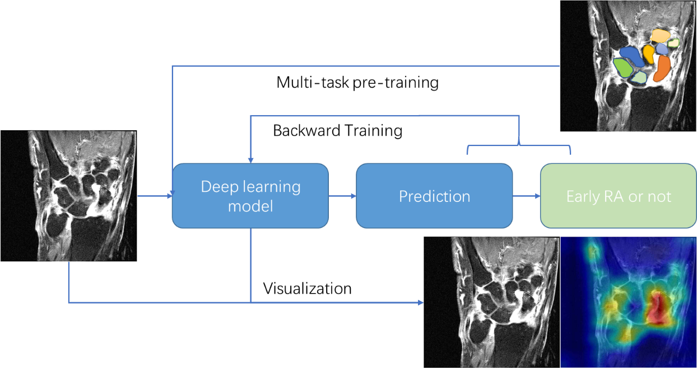

# ESMIRA+ project

Deep learning in the detection of early inflammatory signs in rheumatoid arthritis
This research is supported by the China Scholarship Council (CSC)

September 2021 – August 2025

Principal investigator: Berend C. Stoel

Rheumatoid Arthritis (RA), an autoimmune disease, is a prevalent disease characterized by chronic inflammation and destruction of joints, predominantly in the wrists, hands and feet. This chronic disease can be halted and even cured if detected at the early stage, with drug treatment. However, early identification of RA still remains one of the main challenges in this field.

While MRI is sensitive to early inflammation and RA can be characterized by chronic inflammation, MRI is one of the promising means to detect early RA. Traditional ways of visual scoring of MR scans in RA studies is time-consuming, costly, and relies on perceptual volume estimates. Automatic methods based on quantification of known RA-related biomarkers in MRI, the prior knowledge from experts, have been developed. This kind of approach is helpful but not comprehensive.

The goal of this project is to develop a fully-automatic deep learning-based framework for measuring known and unknown RA-related biomarkers, by directly learning from the image data, and discover new imaging biomarkers that could improve diagnostic accuracy, and in the best case, provide additional knowledge about this disease.

### Associated researchers:
- Yanli Li, MSc, PhD-student
- Denis Shamonin, MSc
- Tahereh Hassan-Zadeh, PhD